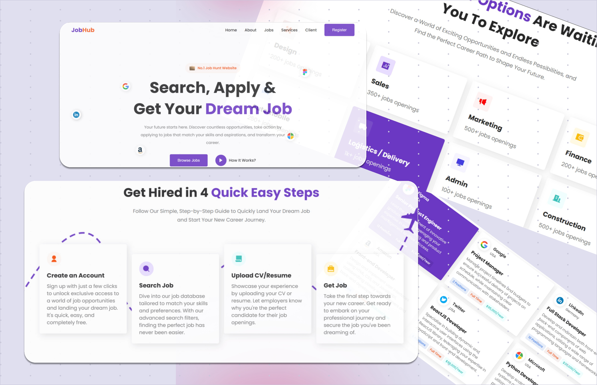

# 💼 Job Hub - Front-End Website

**Job Hub** is a modern, user-friendly static front-end website designed to help users discover and land their dream jobs. Built with **HTML**, **CSS**, and **JavaScript**, it offers a clean and professional layout for showcasing job listings, career tips, and user profiles — all in one place.

---

## 🌟 Project Highlights

- 🔍 Clean job search interface
- 📂 Organized job categories and listings
- 👤 Profile sections to showcase skills and resumes
- 🧠 Career guidance and tips section
- 💡 Built with simplicity, speed, and clarity in mind

---

## 🛠️ Tech Stack

- **HTML5**
- **CSS3** (with responsive design)
- **Vanilla JavaScript**

---

## 📸 Final Result



---

## 🚀 How to Use

1. Clone this repository:
   ```bash
   git clone https://github.com/liyat-1/job-hub.git
   ```
